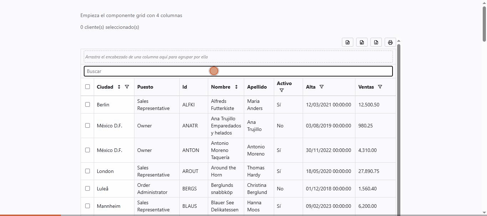

# inandu-grid

A standalone Angular data grid — sorting, filtering, grouping, pagination,
virtual scroll, inline editing, CSV/Excel/PDF export, i18n and theming — with a
deliberately small dependency footprint. A lightweight, MIT-licensed alternative
to the big commercial Angular grids.

[](https://www.npmjs.com/package/@inandu-solutions/grid-angular)
[](https://www.npmjs.com/package/@inandu-solutions/grid-angular)
[](https://bundlephobia.com/package/@inandu-solutions/grid-angular)
[](LICENSE)

[](https://inandusolutions.github.io/inandu-grid/)
[](https://inandusolutions.github.io/inandu-grid/manual.html)
[](https://stackblitz.com/github/inandusolutions/inandu-grid/tree/main/examples/stackblitz)

[](https://inandusolutions.github.io/inandu-grid/)

<sub>Live free-text search on the demo grid. [Try every feature →](https://inandusolutions.github.io/inandu-grid/)</sub>

- **Package:** [`@inandu-solutions/grid-angular`](https://www.npmjs.com/package/@inandu-solutions/grid-angular) (MIT).
  The bare `@inandu-solutions/grid` name is intentionally reserved for a future framework-neutral
  umbrella; a React port would ship as `@inandu-solutions/grid-react`, sharing this repo's
  framework-agnostic core (`projects/inandu-grid/src/lib/core/`).
- **▶️ Live demo:** <https://inandusolutions.github.io/inandu-grid/> — the demo app, try every feature in the browser.
- **⚡ StackBlitz:** [a minimal editable example](https://stackblitz.com/github/inandusolutions/inandu-grid/tree/main/examples/stackblitz) — the grid in a bare Angular app; edit `src/app/app.component.ts` and it updates live ([source](examples/stackblitz)).
- **📘 User manual:** <https://inandusolutions.github.io/inandu-grid/manual.html> — every feature with examples + a full API reference (English). Source: [`docs/manual.html`](docs/manual.html).
- **API summary:** [`projects/inandu-grid/README.md`](projects/inandu-grid/README.md)
- **Commercial add-ons:** `@inandu-solutions/grid-pro` *(proprietary, separate package)*

## Why inandu-grid?

Most full-featured Angular grids are either heavy, or gate the genuinely useful parts —
row grouping, Excel export, cell-range selection, aggregation — behind a paid **enterprise
licence**. inandu-grid is **MIT in full**: every feature on this page is free. It also keeps
a **small dependency footprint** and a modern **Angular-native** design — standalone
components, signal inputs/outputs, no `NgModule`s.

It is deliberately *not* a kitchen sink: no pivoting, no integrated charts, no built-in
server-side row model (you wire your own via `serverSide` + outputs). If you need those,
AG Grid Enterprise is the right tool. If you want a solid, free, lightweight grid, this is it.

| | inandu-grid | AG Grid | PrimeNG Table |
| --- | --- | --- | --- |
| Licence | **MIT, all features** | MIT core + **paid Enterprise** (grouping, Excel, range selection, pivot, tree data…) | MIT |
| Footprint | deliberately minimal (`@angular/cdk`, `@ngx-translate`, `jspdf` lazy-loaded) | large | ships as part of the full PrimeNG library |
| Frameworks | Angular only (signals, standalone) | Angular / React / Vue / vanilla | Angular only |
| Row grouping & aggregates | ✅ free | Enterprise | ✅ |
| Excel / CSV / PDF export | ✅ free (`.xls` + CSV + PDF) | CSV free; Excel is Enterprise | CSV free |
| Pivoting, integrated charts | ❌ | Enterprise | ❌ |
| Server-side row model | bring-your-own (`serverSide`) | Enterprise | bring-your-own |

<sub>Orientation, not a scorecard — check each project's own docs for the current details.</sub>

## What's in this repo

This is an Angular CLI **multi-project workspace**:

| Project | Path | What it is |
| --- | --- | --- |
| `inandu-grid` | `projects/inandu-grid/` | The **library** — the distributable, published to npm as `@inandu-solutions/grid-angular`. Built with `ng-packagr`. |
| `grid-app` | `src/` | The **demo / test harness app**. Not published; it only exists to exercise the library. |

## Requirements

**To use `@inandu-solutions/grid-angular` in your app:**

| | |
| --- | --- |
| Angular | `^21.2.0` (`@angular/core` + `@angular/common`, peer dependencies) |
| Node | whatever your Angular 21 app needs — `^20.19.0 \|\| ^22.12.0 \|\| >=24` |
| Browsers | current Chrome / Firefox / Safari (Safari 16+ for fully correct sticky columns); no IE |

`@angular/cdk`, `@ngx-translate/core`, `jspdf` and `tslib` are pulled in automatically —
nothing to configure. See [`projects/inandu-grid/README.md`](projects/inandu-grid/README.md).

**To develop this repo:**

| | |
| --- | --- |
| Node | `^20.19.0 \|\| ^22.12.0 \|\| >=24` — [`.nvmrc`](.nvmrc) pins **22** |
| npm | 10+ |
| Unit tests | a Chrome / Chromium install (Karma `ChromeHeadless`); optionally Firefox for `--browsers=FirefoxHeadless` |
| e2e | Playwright browsers (`npx playwright install`) — **run under Node 22**; Playwright's test runner currently fails to load under Node 24 |

## Quick start (using the library in your app)

```bash
npm install @inandu-solutions/grid-angular
```

See [`projects/inandu-grid/README.md`](projects/inandu-grid/README.md) for the full
component API, inputs/outputs, and examples.

## Developing this repo

```bash
npm install          # install dependencies
npm start            # build the library, then ng serve — http://localhost:4200
npm run build:lib    # build the library only (dist/inandu-grid)
npm run build        # build library + demo app
npm run lint         # lint both projects
npm run test:lib     # unit tests for the library (Karma/Jasmine, headless Chrome)
npm test             # unit tests for the demo app
npm run e2e          # Playwright end-to-end tests against the built demo
```

> **Workflow gotcha:** the demo app resolves `@inandu-solutions/grid-angular` from the *built*
> output in `dist/inandu-grid`, not from the library's TS source. After changing
> anything under `projects/inandu-grid/src/`, run `npm run build:lib` before
> serving/testing the app, or you'll be looking at stale behavior. `npm start`,
> `npm run build` and the e2e config all build the library first for you.

For a single headless unit-test run without watch mode:

```bash
npx ng test inandu-grid --watch=false --browsers=ChromeHeadless
```

More detail — cross-browser testing, focusing a single spec, architecture — in
[`CONTRIBUTING.md`](CONTRIBUTING.md).

## Contributing

Issues and PRs welcome. Please read [`CONTRIBUTING.md`](CONTRIBUTING.md) first, and
note the [Code of Conduct](.github/CODE_OF_CONDUCT.md). Security reports:
[`.github/SECURITY.md`](.github/SECURITY.md).

## Releasing

Maintainers: see [`PUBLISHING.md`](PUBLISHING.md).

## License

[MIT](LICENSE) © [Inandu SAS](https://inandu.com)
